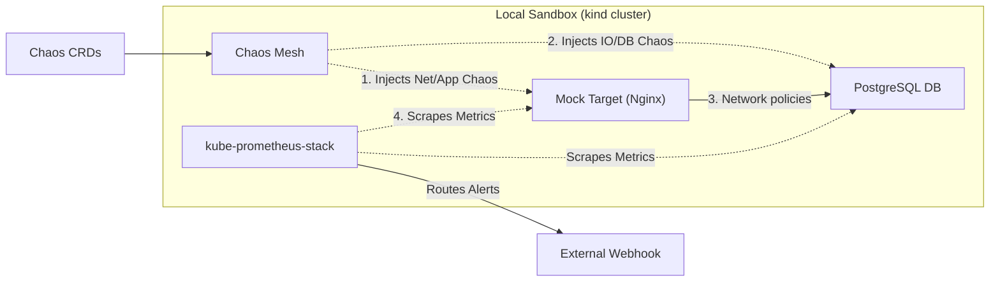

# Test Chaos Mesh

Use Docker, kind, kubectl, Helm

## Components

* **[Cluster](infrastructure/cluster/)**: `kind` cluster specifications and port mappings.
* **[Applications](apps/)**: 
    * **[mock-target](apps/mock-target/)**: Nginx deployment acting as the target service.
    * **[mock-db](apps/mock-db/)**: Real PostgreSQL 15 instance with binary metrics exporter.
* **[Observability](infrastructure/observability/)**: Prometheus Alertmanager rules for Network, App, Security, and DB anomalies.
* **[Chaos Mesh](infrastructure/chaos-mesh/)**: System configurations for container runtime bindings.
* **[Experiments](experiments/)**: Declarative network, pod failure, and HTTP fault definitions.

## Scripts

* **[setup.sh](scripts/setup.sh)**: Create cluster, DB, applications, and Helm distributions.
* **[teardown.sh](scripts/teardown.sh)**: Deletes workloads and configurations while retaining the cluster. --hard to wipe the cluster.
* **[start.sh](scripts/start.sh)**: Starts the suspended cluster Docker containers.
* **[stop.sh](scripts/stop.sh)**: Suspends the active cluster Docker containers.

## Usage

1. Update the webhook target URL defined in **[prometheus-values.yaml](infrastructure/observability/prometheus-values.yaml)** to point to alert receiver.
2. Execute **[setup.sh](scripts/setup.sh)** to bootstrap the sandbox.
3. Inject disruption:
    * Network: `kubectl apply -f experiments/network-loss-chaos.yaml`
    * Database I/O: `kubectl apply -f experiments/io-chaos-db.yaml`
    * DB crash: `kubectl apply -f experiments/pod-kill-db.yaml`
4. Monitor the external webhook or **[Grafana](http://localhost:30030)** for ingested alerts.
5. Execute **[teardown.sh](scripts/teardown.sh)** to clean active workloads.

